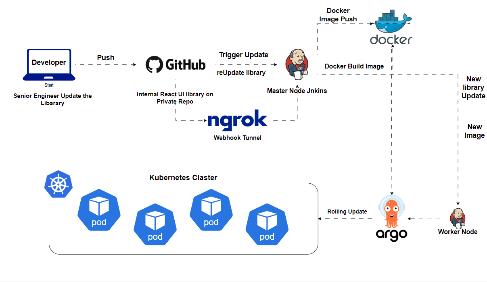

## Project Overview: Automating React UI Library Deployment Using Docker, Kubernetes, Jenkins, and ArgoCD

This project automates the CI/CD pipeline for an internal React UI library to streamline the process of synchronizing, building, and deploying new updates across multiple tools. The solution leverages Docker, Kubernetes, Jenkins, and ArgoCD to create a robust deployment pipeline that reduces manual intervention and ensures the library is always up-to-date with the latest changes.

The internal React UI library is designed to provide ready-made components that can be used by various development teams within the company. The primary challenge is ensuring that updates made by the UI library developers are seamlessly integrated into the tools without issues like broken components, missing dependencies, or miscommunication between teams.

---

### Key Features:
- **Containerization with Docker**: Provides a consistent runtime environment for development and production.
- **Kubernetes Orchestration**: Manages deployment, scaling, and resource optimization for the UI library.
- **CI/CD Pipeline with Jenkins**: Automates the build, test, and deployment processes, ensuring updates are delivered seamlessly.
- **ArgoCD for Continuous Deployment**: Facilitates GitOps-based continuous deployment, ensuring that the deployed versions are always in sync with the Git repository.
- **Security and Resource Management**: Optimizes resource usage, monitors application health, and ensures secure deployment.
- **Documentation and Visualization**: Provides comprehensive documentation and visualizations for better understanding and collaboration.

---

### Technologies Used:
- **Node.js**: JavaScript runtime for building the React UI library.
- **Docker**: Containerization technology to package the UI library and ensure consistent environments.
- **Kubernetes**: Container orchestration platform for scaling and managing application deployments.
- **Jenkins**: CI/CD automation tool to streamline building and deployment pipelines.
- **ArgoCD**: GitOps tool to automate the continuous deployment process, ensuring that the application is always deployed as per the Git repository state.
- **GitHub**: Version control system to store and manage code.
- **Docker Hub**: Docker registry to host and distribute container images.

---

### Benefits of the Solution:
- **Automated Process**: Automates the build, test, and deployment workflows, minimizing manual intervention.
- **Consistency**: Ensures that the library is consistently deployed across environments with Docker and Kubernetes.
- **Scalability**: Kubernetes allows easy scaling of applications as demand grows.
- **Reduced Downtime**: Automated deployments and monitoring ensure minimal downtime during updates.
- **GitOps Deployment with ArgoCD**: Continuous deployment with ArgoCD ensures the application state is always synchronized with the Git repository, making updates faster and safer.

The Automated UI Library enhances collaboration between UI library developers and tool developers, automates error-prone processes, and ensures the reliable deployment of components.

---

### Objectives:
- **Automate Component Development**: Implement CI/CD pipelines for quick updates to the React UI library.
- **Automate Update Triggers**: Use webhooks for continuous synchronization between the UI library and development tools.
- **Enhance Component Reliability**: Implement automated testing for quality assurance.
- **Document and Visualize the Workflow**: Provide comprehensive usage guidelines and visualizations to improve team collaboration.

---

## React 组件库搭建指南

- [React 组件库搭建指南（一）：项目初始化](https://github.com/worldzhao/blog/issues/3)
- [React 组件库搭建指南（二）：开发调试](https://github.com/worldzhao/blog/issues/4)
- [React 组件库搭建指南（三）：编译打包](https://github.com/worldzhao/blog/issues/5)
- [React 组件库搭建指南（四）：单元测试](https://github.com/worldzhao/blog/issues/6)
- [React 组件库搭建指南（五）：标准化发布流程](https://github.com/worldzhao/blog/issues/7)

[🚀 在线预览](https://worldzhao.github.io/react-ui-library-tutorial)

🚆 